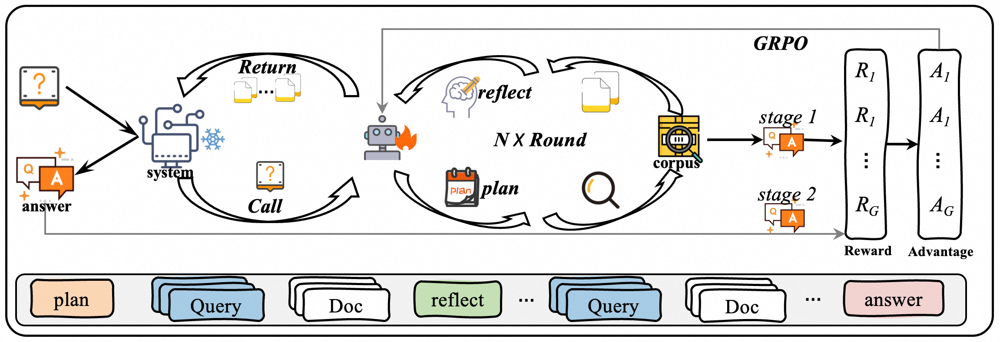
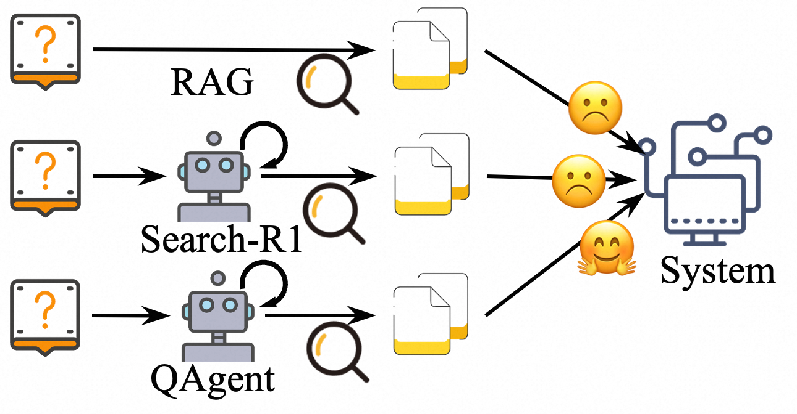
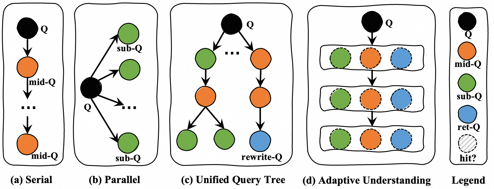
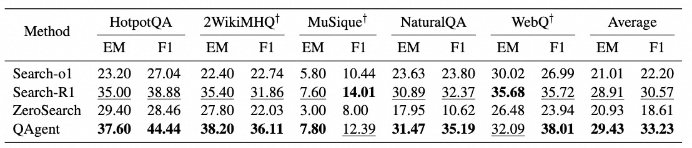
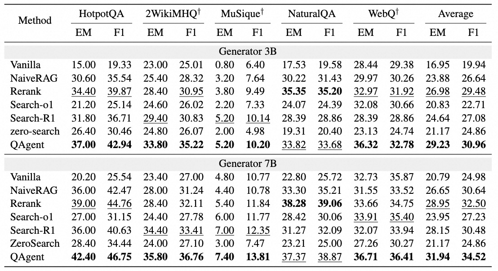
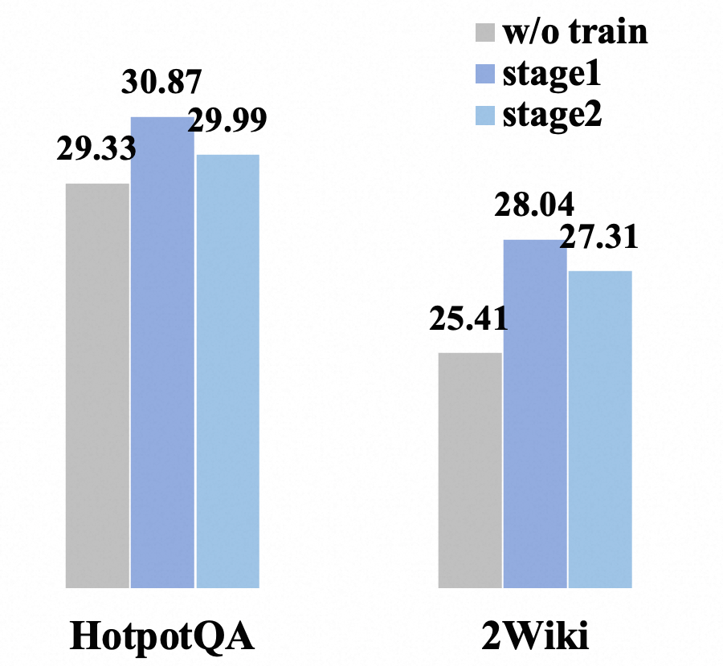
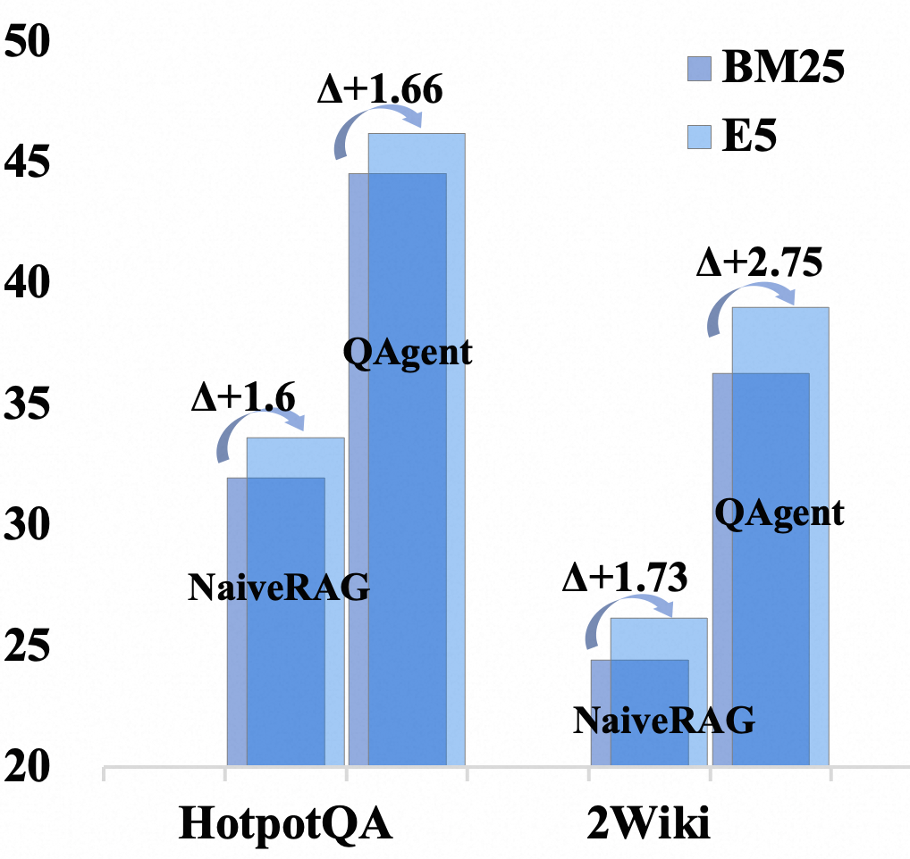
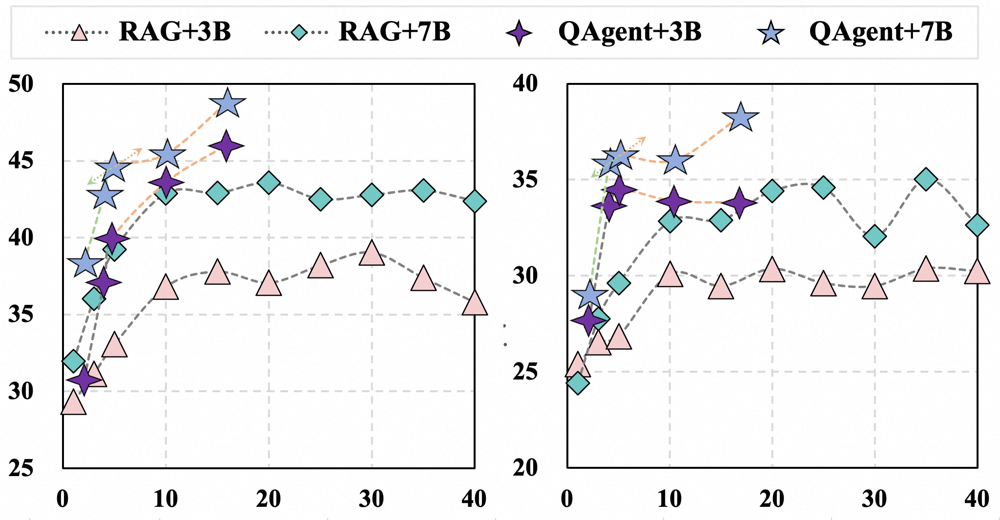

<p align="center">

  <h2 align="center"><strong>QAgent: A modular Search Agent with Interactive Query Understanding</strong></h2>

<p align="center">

  <a href="https://arxiv.org/pdf/2510.08383">
    
  </a>
</p>

<div align="center">
</div>


## 🌞 Introduction
> QAgent, a unified agentic RAG framework that employs a search agent for adaptive retrieval. This agent optimizes its understanding of the query through interactive reasoning and retrieval.
To facilitate real-world application, we focus on modular search agent for query understanding that are plug-and-play in complex systems.
Secifically, the agent follows a multi-step decision process trained with RL to maximize retrieval quality and support accurate downstream answers. 
We further analyze the strengths and weaknesses of end-to-end RL and propose a strategy that focuses on effective information retrieval, thereby enhancing generalization in LLM applications.

<div align="center">


**Framework**
</div>


<div align="center">



**Key Features: (1) System-friendly; (2) Query Understanding**
</div>


### 💡 Preparation

<details>
<summary>
<em>Download Corpus & Index & retrievers</em>
</summary>

```bash
Details will be completed soon
```
</details>


### 📑 Code Architecture
<pre style="font-size: 0.75em; line-height: 1.15;">
.
├── README.md
├── assets        
├── config.py
├── grpo_loss.py
├── main_grpo_v0.py         # Training start, trl
├── main_grpo_v1.py         # Training started, using LigerKernel optimization
├── refer_llm               # Reference Model service
│   ├── __init__.py
│   ├── refer_client.py
│   ├── refer_server.py
│   └── tensor_utils.py
├── requirements.txt
├── retrieval               
│   ├── retrieval_bm25.py  
│   └── retrieval_e5.py    
├── rewards                
│   ├── __init__.py
│   └── reward_QAgent.py
├── rollout                
│   ├── __init__.py
│   ├── base_rollout.py
│   └── rollout_QAgent.py
├── run.py
├── run.sh
└── tools.py                # Encapsulate tool functions, such as search requests
</pre>


### 🎯 Run Training
<details>
<summary>
<em>Training Configuration </em>
</summary>
  
```bash
Details will be completed soon
```
</details>

<details>
<summary>
<em>Run Training </em>
</summary>
  
```bash
Details will be completed soon
```
</details>


### 📈 Run Evaluation
<details>
<summary>
<em>Prepare Evaluation Data</em>
</summary>
Details will be completed soon
</details>

<details>
<summary>
<em>Run Evaluation<em>
</summary>
Details will be completed soon
</details>


### 📊 Performance
<div align="center">


**Main results of end-to-end performance**
</div>
<div align="center">


**Main results when used as a submodule.**
</div>

### 🔬 Analysis
<div align="center">




**Key Features: (1)Information utilization; (2) Different retriever; (3)Combined Gain**
</div>

### Limitation
- Training on larger models and practical scenarios. 
- Failure to control passage diversity. 


### Acknowledge
We sincerely appreciate the efforts of these teams for their contributions to open-source research and development: [Search-R1](https://github.com/PeterGriffinJin/Search-R1), [LigerKernel](https://github.com/linkedin/Liger-Kernel), [TRL](https://github.com/huggingface/trl), [vLLM](https://github.com/vllm-project/vllm), [Simple-GRPO](https://github.com/lsdefine/simple_GRPO).

## Citation
```bibtex
@article{jiang2025qagent,
  title={QAgent: A modular Search Agent with Interactive Query Understanding},
  author={Jiang, Yi and Shen, Lei and Niu, Lujie and Zhao, Sendong and Su, Wenbo and Zheng, Bo},
  journal={arXiv preprint arXiv:2510.08383},
  year={2025}
}
```

Thanks for your interest in our work!
